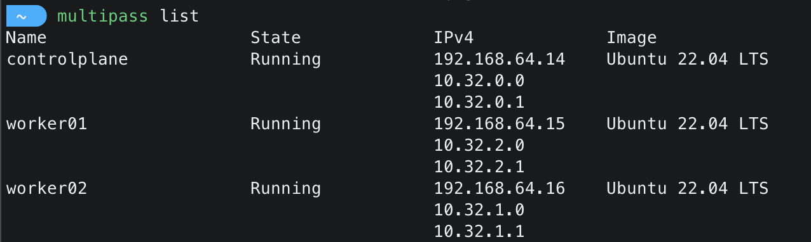

# Kubernetes cluster setup using Kubeadm and Ansible

This repo contains two playbooks

1. Kubernetes nodes creation
2. Kubernetes cluster setup

## Kubernetes nodes creation
You can skip to [this](#kubernetes-cluster-setup) section, If you already have nodes created to setup cluster.

System requirements:
- Apple mac 
- CPU >= 8
- Memory >= 8GB

**Note:** If you are on windows or linux you could follow [this](https://multipass.run/docs) guide to install multipass and create nodes.
### Usage

By default this will create 3 nodes. You can update nodes count in `roles/compute_resources/defaults/main.yml` by adding/removing node_names
```yaml
nodes:
    - controlplane
    - worker01
    - worker02
    - worker<n>
```
```bash
ansible-playbook kubernetes_nodes_creation.yaml
```
This will create 3 virtual machines with Ubuntu 22.04 LTS.
- 1 master node
- 2 worker nodes 

It uses [multipass](https://multipass.run/docs) tool to create virtual machines.
It will also enable passwordless SSH access between nodes.

#### List nodes

You could use below command to list the nodes created by multipass
```bash
multipass list
```
You should see output similar to below screenshot



#### SSH into nodes

You can connect to instance using multipass or direct SSH.
You could use below command to enter inside node using multipass
```bash
multipass shell <node_name>
```
You could also use SSH command.You can get ip address from `multipass list` command.Private key file `.ssh/kubernetes` will be created as part of the above Ansible play.
```bash
ssh -i .ssh/kubernetes ubuntu@<ip_of_node>
```

Once you are inside any one of the machine, you can access other machines by just using 
```bash
ssh <node_name>
# ssh controlplane
# ssh worker01
```
## Kubernetes cluster setup

We need 1 node for master and atleast 1 node to act as worker. All nodes should have below requirements satisified.
System requirements:
- Ubuntu or Debian OS
- Passwordless SSH connectivity between nodes


### Usage
Update `inventory.ini` file with node ip details

```ini
[kube_master_nodes]
controlplane ansible_host=192.168.64.14

[kube_worker_nodes]
worker01 ansible_host=192.168.64.15
worker02 ansible_host=192.168.64.16

[kube_nodes:children]
kube_master_nodes
kube_worker_nodes
```

If you are using different user than `ubuntu` in your nodes then update `group_vars/all.yml`

```yaml
service_account: <user_name>
```

If you havent added dns resolution for nodes to access using node names then update `group_vars/all.yml` to have ip of the node instead of nodename

```yaml
master_node: <ip_of_the_master_node>
```
You can also update networking solution you wish to deploy.Currently it supports flannel, weave-net
```yaml
network_solution: <solution_name>
```
Update SSH private_key_file path in your host machine in `ansible.cfg`. This will be used while access nodes from your machine.

You can now run the playbook using below command to setup the cluster on your nodes
```bash
ansible-playbook kubernetes_cluster_setup.yaml
```
